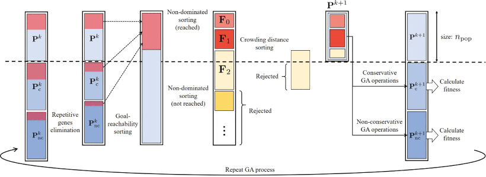

# MSR_MOGA

MSR_MOGA is a multi-objective genetic-algorithm based path planning approach for modular self-reconfigurable robots. The program is developed and simulated under Processing environment. 

## MOGA Model



## Setup
Install and directly run the code under [Processing](https://processing.org/download/).

## Paper
- ***Multi-Objective Genetic Algorithm-Based Autonomous Path Planning for Hinged-Tetro Reconfigurable Tiling Robot***
([Link to Paper](https://ieeexplore.ieee.org/abstract/document/9131750))

To cite the paper through BibTeX:
```
@ARTICLE{9131750,
  author={P. C. {Ku} and R. E. {Mohan} and N. H. {Khanh Nhan} and A. V. {Le}},
  journal={IEEE Access}, 
  title={Multi-Objective Genetic Algorithm-Based Autonomous Path Planning for Hinged-Tetro Reconfigurable Tiling Robot}, 
  year={2020},
  volume={8},
  pages={121267-121284},}
```
## Contact
You can contact me through pku1@jhu.edu if you have any questions.
